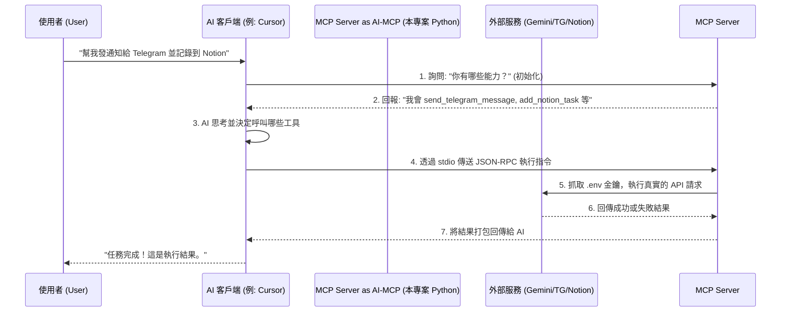

# AI-MCP 完整運作架構與開發擴充指南

這份文檔詳細說明了本專案 (AI-MCP) 的底層運作邏輯、日常操作設定指南，以及未來如何自行開發擴增新功能的教學。

---

## 壹、 MCP 運作架構 (Architecture)

**Model Context Protocol (MCP)** 是一個標準化的通訊協定，旨在讓各種不同的 AI 客戶端 (如 Cursor 編輯器、Claude 桌面版) 能夠統一地呼叫外部「工具 (Tools)」與「資源 (Resources)」。

### 核心運作流程圖



### 為什麼採用這種架構？
1. **安全性極高**：API Keys (`.env`) 全部存在您的本地電腦，不會上傳到 Claude 或 Cursor 的伺服器。
2. **零延遲擴充**：AI 本身沒有聯網能力，但透過這個 Python 中介層，瞬間獲得操控您私人系統、智慧家電、或企業內部資料庫的權限。

---

## 貳、 操作與設定指南 (Operational Guide)

### 1. 環境變數設定
專案啟動前，必須要有對應的金鑰。
- 將專案根目錄的 `.env.example` 複製一份並重新命名為 `.env`。
- 依照 `.env.example` 內的中文註解步驟，填寫 **Google Gemini**, **Telegram**, 以及 **Notion** 的 API 金鑰。

### 2. 環境安裝與啟動
進入您的專案資料夾 (`c:\Users\p1990\project\ai-mcp`)。

**啟動虛擬環境**:
- Windows PowerShell: `.\venv\Scripts\Activate.ps1`
- Windows CMD: `.\venv\Scripts\activate.bat`

**安裝依賴套件**:
```bash
pip install -r requirements.txt
```

**單獨啟動測試 (確認沒有語法錯誤)**:
```bash
python -m ai_mcp.server
```
*(如果啟動後終端機停住不動，代表伺服器已成功以 `stdio` 模式啟動並正在監聽，您可以按 `Ctrl+C` 關閉)*

### 3. 如何將本 MCP 掛載到 AI 客戶端？
以目前最主流的 **Cursor** 與 **Claude Desktop** 為例：

#### 在 Cursor 中使用：
1. 打開 Cursor 設定 (Settings) -> `Features` -> `MCP`。
2. 點擊 **+ Add New MCP Server**。
3. **Name**: `Auto-Integrations-Server` (自訂名稱)。
4. **Type**: 選擇 `command`。
5. **Command**: 輸入啟動指令。因為必須要在虛擬環境下執行，請輸入**絕對路徑**，例如：
   ```bash
   c:/Users/p1990/project/ai-mcp/venv/Scripts/python.exe -m ai_mcp.server
   ```
   *(注意：請將終端機執行的路徑切換至您的專案根目錄，或在指令中指定 cwd)。*
6. 點擊 Save，看到綠色燈號亮起，代表 Cursor 已經學會這些新工具了！

#### 在 Claude Desktop 中使用：
Claude 官方推出的桌面版原生支援 MCP，但沒有像 Cursor 一樣的圖形介面，必須手動編輯設定檔：
1. 打開您的檔案總管 (File Explorer)，在網址列輸入 `%APPDATA%\Claude` 並按下 Enter。
2. 找到 `claude_desktop_config.json` 檔案（如果沒有請自行建立一個）。
3. 使用任何文字編輯器打開它，並將您的 MCP 伺服器加入到 `mcpServers` 區塊中：
   ```json
   {
     "mcpServers": {
       "ai-mcp": {
         "command": "c:/Users/p1990/project/ai-mcp/venv/Scripts/python.exe",
         "args": ["-m", "ai_mcp.server"]
       }
     }
   }
   ```
4. **存檔後，完全關閉並重新啟動 Claude Desktop**。
5. 點擊 Claude 聊天視窗右下角的小插頭圖示 🔌，您就會看到我們寫好的 `ask_gemini`, `send_telegram_message`, `add_notion_task` 出現在清單中！

#### 如果沒有 Cursor 或是 Claude Desktop 怎麼辦？
MCP 是一個開源且通用的標準，現在已經有很多其他方法可以使用它：

1. **Windsurf / PearAI 等其他新創編輯器**：
   這些新興的 AI 編輯器也多半支援了 MCP，設定方式與 Cursor 非常類似，通常在設定 (Settings) -> MCP 區塊就能找到。
   
2. **VS Code + Cline 外掛 (免費且強大)**：
   如果你平常使用的是免費的 VS Code，你可以安裝一款叫做 **`Cline`** 的免費開源外掛。
   - Cline 支援輸入你自己的 API Key (甚至可以完全用免費的 Gemini Key!)。
   - 在 Cline 的側邊欄中點擊類似插頭的圖示 `MCP Servers`，即可加入你的指令：`c:/Users/p1990/project/ai-mcp/venv/Scripts/python.exe -m ai_mcp.server`。
   
3. **MCP Inspector (官方純測試工具)**：
   如果你什麼 AI 都不想裝，只想單純「測試」你剛剛寫的 Python 程式到底能不能順利發 API，Anthropic 官方提供了一個檢測網頁工具。
   在專案終端機內輸入：
   ```bash
   # 這會需要你的電腦有裝 Node.js
   npx @modelcontextprotocol/inspector c:/Users/p1990/project/ai-mcp/venv/Scripts/python.exe -m ai_mcp.server
   ```
   執行後，終端機會給你一個像 `http://localhost:5173` 的網址，點開來你就能在網頁上直接看到你寫的工具，並手動點擊測試了。

4. **與自建的 OpenClaw 或其他開源 ChatBot 串接**：
   如果你自己架設了像 OpenClaw 這樣的聊天機器人，而且想讓你的聊天機器人具備這些 MCP 工具，你通常可以透過兩種方式串接：
   - **透過設定檔掛載 (stdio)**：如果您的聊天機器人架構支援 `stdio` 模式，通常會有一個對應的 JSON 設定檔。您可以比照 Claude Desktop 的方式，將 `command: python`, `args: ["-m", "ai_mcp.server"]` 加入其設定中。
   - **透過 HTTP / SSE 模式 (需轉換)**：目前我們的專案是以標準的 `stdio` 運作（最適合本地編輯器）。如果您的 OpenClaw 架構在遠端伺服器 (Docker) 上，需要透過網路 (HTTP) 呼叫您的 MCP 工具，您只需在我們專案的 `server.py` 最下方，將 `mcp.run(transport="stdio")` 改為使用 SSE 傳輸協定即可 (需安裝 FastMCP 的 SSE 擴充套件，並指定 IP 與 Port 讓外部 API 呼叫)。

---

## 參、 功能擴充指南 (Expansion Guide)

如果您想自己新增其他功能 (例如：連接 Line Bot, 查詢今天天氣, 自動回覆 Email 等)，非常簡單！本專案採用 `FastMCP` 框架，只要會寫基本的 Python 函式就能擴充。

### 擴充步驟教學

1. 打開 `src/ai_mcp/server.py` 檔案。
2. 在任意空白處，撰寫一個普通的 Python 函式。
3. 在函式上方加上 `@mcp.tool()` 裝飾器。
4. **【最重要的一步】**：一定要寫 **Type Hints (型別提示)** 以及詳細的 **Docstring (註解說明)**。AI 就是靠這兩樣東西來理解這個工具是做什麼用的。

### 擴充範例：新增一個「查詢假天氣」的工具

```python
import random
from mcp.server.fastmcp import FastMCP

# ... (現有程式碼) ...

@mcp.tool()
def get_current_weather(city_name: str) -> str:
    """
    查詢指定城市的目前天氣與溫度。
    當使用者詢問天氣時，AI 會自動呼叫這個函式。
    
    參數:
        city_name (str): 城市名稱，例如 "Taipei" 或 "Tokyo"
    """
    # 這裡你可以替換成呼叫真實氣象局 API 的程式碼 (如 requests.get(...))
    # 以下為模擬回傳
    weather_types = ["晴朗", "下雨", "多雲", "暴風雪"]
    temp = random.randint(15, 35)
    condition = random.choice(weather_types)
    
    return f"{city_name} 目前天氣為 {condition}，氣溫約 {temp} 度C。"
```

### 擴充指南的 3 個黃金法則
1. **防呆與錯誤處理 (`try...except`)**：AI 不知道你的 API 是否會當機。如果外部服務連線失敗，請在 Python 裡面 `return "錯誤: 連線失敗"`，千萬不要讓整個程式 Crash 崩潰 (拋出 Exception)，否則 MCP 伺服器會斷線。
2. **回傳值必須是字串 (String)**：對 AI 來說，最好的回傳格式是單純的字串或 Markdown。如果你從資料庫撈出了一大包 JSON，請將它轉成清楚的字串再 Return。
3. **適時的 Print (或 Logger logging)**：如果在你的工具裡面加上 `logger.info("...")`，當 MCP 在背景執行時，AI 客戶端的後台日誌就可以看到這些紀錄，有助於 Debug。
